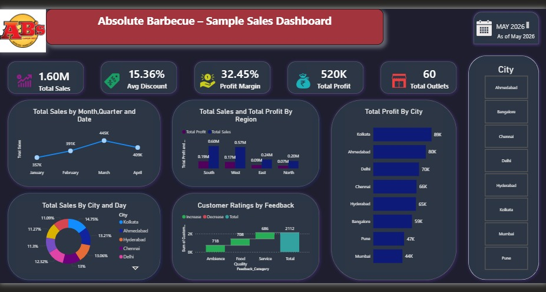

# Absolute-Barbecue-Sample-Sales-Dashboard
An interactive Power BI dashboard analysing pan-India sales, profitability, and customer performance for Absolute Barbecue.
## Project Overview
An interactive Power BI dashboard analysing sample sales of Absolute Barbecue.

## Key Insights
- South region is the top-performing region in both total sales and total profit.
- March records the highest sales across the observed period.
- Weekends generate higher sales contribution compared to weekdays.
- Kolkata and Ahmedabad emerge as the most profitable cities.
- Service feedback contributes the highest positive impact on customer ratings.

## Tools & Skills Used
- Microsoft Excel (data cleaning & feature engineering)
- SQL (data validation and structuring)
- Power BI (data modelling, DAX, interactive dashboard design)

## Dashboard Preview

